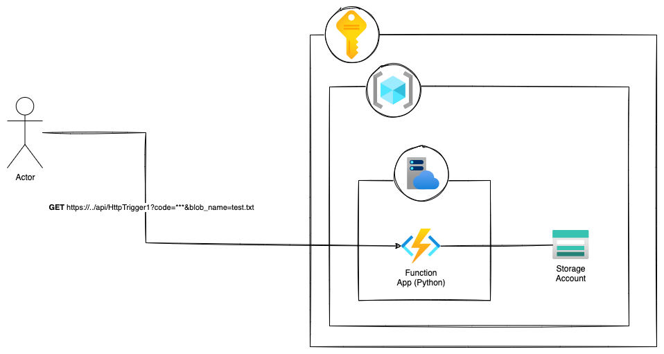
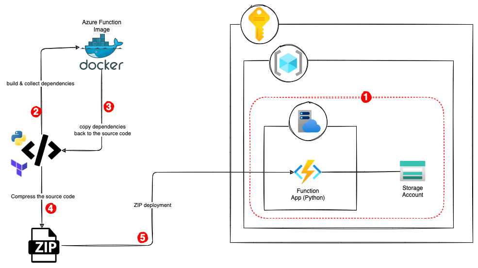

# Azure Function Zip-Deployment

## Introduction

In this repository, I will show how to deploy an Azure Function App and publish the code functions using Zip-Deploy
approach regardless of the development machine OS.

As an example, I will deploy an Azure function App with HTTP trigger and an Azure Storage Account.
The HTTP trigger expects a request parameter `blob_name` and returns the content of the corresponding blob if it does
exist in the `default` container in the Azure Storage Account, otherwise it returns 404 not found.



## Problem

After the a (apparently) successful deployment, it was expected to read the content fo a blob in `default` container in the
storage account by calling `https://az-func-app-http.azurewebsites.net/api/HttpTrigger1?code=**&blob_name=test.txt` for
example.
Surprisingly, I got `500 INTERNAL_SERVER_ERROR` response. Thanks to Azure Application Insights, I could find the root
cause of that internal server error response.

The problem starts from my Mac-OS development machine, on which the dependencies are collected.

During deployment process, one of the base dependency of `azure.storage.blob` module
is [cryptography](https://cryptography.io/en/latest/installation/#supported-platforms)
library, which has native code and is built differently depending on the OS.
Since, I do have a `macOS Monterery`, the runtime environment is incompatible with any other OS. 
However, the OS of my Azure Function App is `linux/amd64`, which will not work definitely with the dependencies built on
`macOS Monterery` and will raise an `ImportError`.

> ```python
> Result: Failure Exception: ImportError:
>     /home/site/wwwroot/.python_packages/lib/site-packages/cryptography/hazmat/bindings/_rust.abi3.so: invalid ELF header.
>     Please check the requirements.txt file for the missing module.
>     For more info, please refer the troubleshooting guide: https://aka.ms/functions-modulenotfound Stack:
>     ... 
>     in _call_with_frames_removed File "/home/site/wwwroot/HttpTrigger1/__init__.py",  line 3,
>     in <module> from azure.storage.blob import BlobServiceClient, ContainerClient File "/home/site/wwwroot/.python_packages/lib/site-packages/azure/storage/blob/__init__.py", line 10,
>     in <module> from ._blob_client import BlobClient File "/home/site/wwwroot/.python_packages/lib/site-packages/azure/storage/blob/_blob_client.py", line 55, 
>     ...
>     in <module> from cryptography.x509 import certificate_transparency File "/home/site/wwwroot/.python_packages/lib/site-packages/cryptography/x509/certificate_transparency.py", line 10,
>     in <module> from cryptography.hazmat.bindings._rust import x509 as rust_x509
> ```

## Solution

To solve the issue, we need to build the dependencies on the OS used by our **Azure Function App**.
This could be done of course using [Docker](https://docs.docker.com) relying on the `mcr.microsoft.com/azure-functions/python` image
(all supported azure function images could be found [here](https://hub.docker.com/_/microsoft-azure-functions)).

So, step-by-step solution is as following:
1. Deploy the essential infrastructures (App Service plan, Function App and Storage Account).
2. Build a Docker container and install the dependencies inside it.
3. Copy the dependencies from the docker container to `.python_packages` in the source code folder (of the functions).
4. Compress the source code folder of the functions in a ZIP file.
5. Publish the code using `az functionapp deployment source config-zip`

> _**Hint:** Docker must be installed and running on the development machine first._

